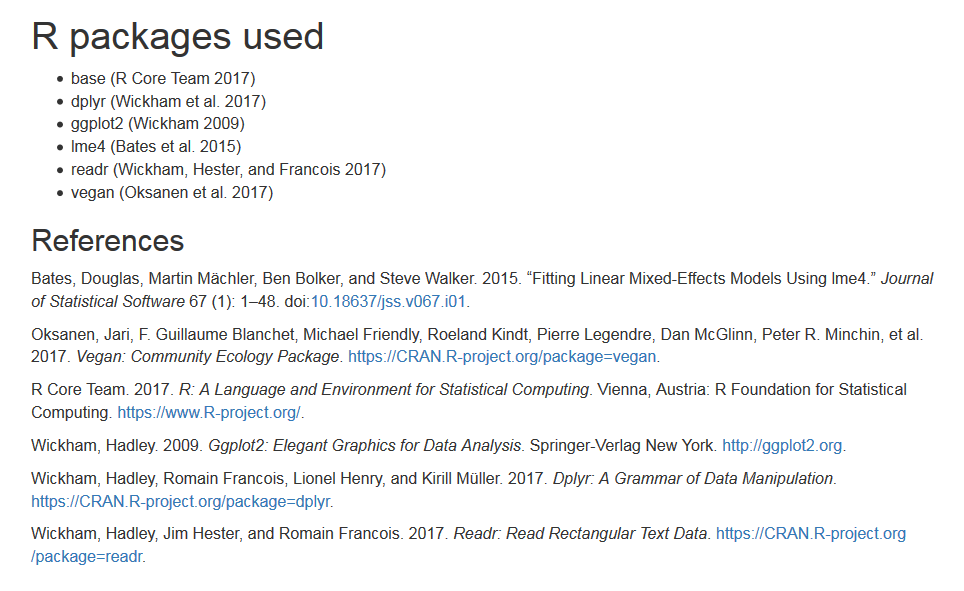

---
output:
  md_document:
    variant: markdown_github
---

<!-- README.md is generated from README.Rmd. Please edit that file -->

```{r, echo = FALSE}
knitr::opts_chunk$set(
  collapse = TRUE, eval = FALSE, 
  comment = "#>",
  fig.path = "README-figures/"
)
```

# grateful

The goal of `grateful` is to make it very easy to cite the R packages used in any report or publication. By calling a single function, it will scan the project for R packages used and generate a document with citations in the desired output format (Word, PDF, HTML, Markdown). Importantly, these references can be formatted for a specific journal so that we can just paste them directly into the bibliography list of our manuscript or report.


## Installation

```{r eval=FALSE}
library(devtools)
install_github("Pakillo/grateful")
```


## Basic usage

Imagine a project where we are using the following packages: readr, dplyr, vegan, lme4, and ggplot2. Calling `cite_packages` will scan the project, find these packages, and generate a document with formatted citations.


```{r example, eval = FALSE}
library(grateful)
cite_packages()
```



This document can also be a Word document, PDF file, markdown file, or Rmarkdown file. And use the citation style of a particular journal:

```{r eval = FALSE}
cite_packages(style = "ecology", out.format = "docx")
```

You can also save the output of `cite_packages` to a specified directory.

```{r eval = FALSE}
# Save the output in Rmarkdown format only and to a docs folder.
cite_packages(out.format = "rmd", out.dir = file.path(getwd(), "docs"))
```


## Workflow

`cite_packages` is a wrapper function which internally performs the following steps:

1 Scan the project for packages

```{r}
pkgs <- scan_packages()
```

2 Get citations for each package

```{r}
cites <- get_citations(pkgs)
```

3 Create an rmarkdown document citing all these packages

```{r}
rmd <- create_rmd(cites)
```

4 Rendering the rmarkdown document to the desired output format

```{r}
render_citations(rmd, output = "html")
```
