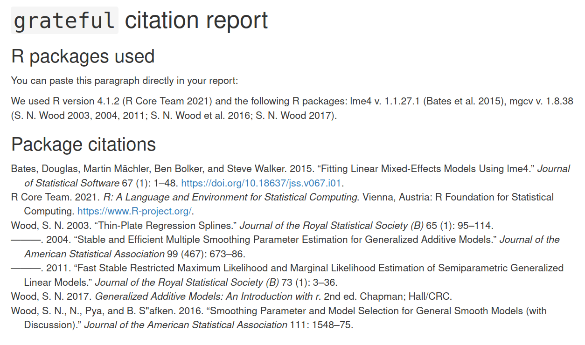

<!-- README.md is generated from README.Rmd. Please edit that file -->

# grateful: Facilitate citation of R packages

<!-- badges: start -->

[](https://github.com/Pakillo/grateful/actions)
<!-- badges: end -->

The goal of **grateful** is to make it very easy to cite R and the R
packages used in any analyses, so that package authors receive their
deserved credit. By calling a single function, it will scan the project
for R packages used, and generate a BibTeX file containing all citations
for those packages.

**grateful** can then generate a new document with citations in the
desired output format (Word, PDF, HTML, Markdown). These references can
be formatted for a specific journal so that we can just paste them
directly into our manuscript or report.

Alternatively, we can use **grateful** directly within an Rmarkdown
document. In this case, a paragraph containing in-text citations of all
used R packages will (optionally) be inserted into the Rmarkdown
document, and these packages will be included in the reference list when
rendering.

## Installation

``` r
# install.packages("remotes")
remotes::install_github("Pakillo/grateful")
```

## Usage

**grateful** can be used in one of two ways: to generate a new document
listing each package and its citation, as well as a references list, or
to build citation keys to incorporate into an existing RMarkdown
document.

Imagine a project where we are using the packages: *lme4* and *mgcv*. We
want to collect all the citations listed for these packages, as well as
a citation for base R (and for RStudio, if applicable).

### Generate a New References Document

Calling `cite_packages(output = "file")`, or simply `cite_packages()`,
will scan the project, find these packages, and generate a document with
formatted citations.

``` r
library(grateful)
cite_packages(output = "file")
```



This document can also be a Word document, PDF file, markdown file, or
left as the source Rmarkdown file using `out.format`. We can specify the
citation style for a particular journal using `citation.style`.

``` r
cite_packages(citation.style = "peerj", out.format = "docx")
```

In all cases a BibTeX (.bib) file with all package citations will be
saved to disk. If

### Using grateful within Rmarkdown

If you are building a document in RMarkdown and want to cite R packages,
**grateful** can automatically generate a BibTeX file and ensure these
packages are cited in the appropriate format.

First, include a reference to the BibTeX file in your YAML header.

    bibliography: grateful-refs.bib

RMarkdown lets you reference multiple BibTeX files, if needed.

    bibliography: 
    - document_citations.bib
    - grateful-refs.bib

Then call `cite_packages(output = "paragraph")` within a code chunk
(specifying chunk option: results = “asis”) to automatically include a
paragraph mentioning all the used packages and include their references
in the bibliography list.

``` r
cite_packages(output = "paragraph")
```

`We used R version 4.1.2 [@base] and the following R packages: lme4 v. 1.1.27.1 [@lme4], mgcv v. 1.8.38 [@mgcv2003; @mgcv2004; @mgcv2011; @mgcv2016; @mgcv2017].`

Alternatively, you can cite particular packages using the citation keys
generated by **grateful** as with any other BibTeX reference, or just
include citations in the References section, using the function
`nocite_references()`.

## Limitations

Citation keys are not guaranteed to be preserved when regenerated,
particularly when packages are updated. This instability is not an issue
when citations are used programmatically, as in the example above. But
if references are put into the text manually, they may need to be
updated periodically.
