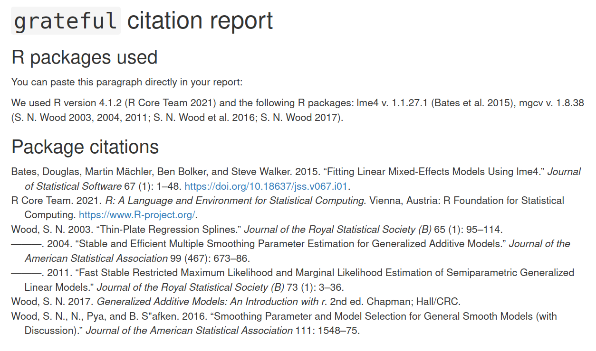
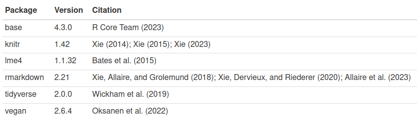
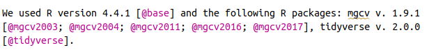
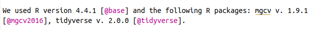

<!-- README.md is generated from README.Rmd. Please edit that file -->

# grateful: Facilitate citation of R packages

<!-- badges: start -->

[](https://cran.r-project.org/package=grateful)

<a href="https://diffify.com/R/grateful" target="_blank"></a>
[](https://github.com/Pakillo/grateful/actions/workflows/R-CMD-check.yaml)
[](https://app.codecov.io/gh/Pakillo/grateful?branch=master)
[](https://lifecycle.r-lib.org/articles/stages.html#stable)
[](https://www.repostatus.org/#active)
[](https://cran.r-project.org/package=grateful)
<!-- 
[](https://hits.dwyl.com/Pakillo/grateful)
[](https://hits.dwyl.com/Pakillo/grateful)
--> <!-- badges: end -->

The goal of **grateful** is to make it very easy to cite R and the R
packages used in any analyses, so that package authors receive their
deserved credit. By calling a single function, **grateful** will scan
the project for R packages used and generate a BibTeX file containing
all citations for those packages.

**grateful** can then generate a new document with citations in the
desired output format (Word, PDF, LaTeX, HTML, Markdown). These
references can be formatted for a specific journal, so that we can just
paste them directly into our manuscript or report.

Alternatively, we can use **grateful** directly within an
[Rmarkdown](https://rmarkdown.rstudio.com/) or
[Quarto](https://quarto.org/) document. In this case, a paragraph
containing in-text citations of all used R packages will (optionally) be
inserted into the Rmarkdown/Quarto document, and these packages will be
included in the reference list when rendering.

## Installation

You can install the stable release of {grateful} from CRAN:

``` r
install.packages("grateful")
```

Or the latest development version from
[R-universe](https://pakillo.r-universe.dev/grateful):

``` r
install.packages("grateful", repos = c("https://pakillo.r-universe.dev", "https://cloud.r-project.org"))
```

Or from GitHub:

``` r
# install.packages("remotes")
remotes::install_github("Pakillo/grateful")
```

## Usage

**grateful** can be used in one of two ways:

1.  to generate a ‘citation report’ listing each package and their
    citations

2.  to build citation keys to incorporate into an existing R Markdown or
    Quarto document.

### Example

Imagine a project where we are using the packages: *dplyr*, *ggplot2*,
*vegan* and *lme4*. We want to collect all the citations listed for
these packages, as well as a citation for base R (and for RStudio, if
applicable).

### Generate a document with formatted citations

Calling `cite_packages()` will scan the project, find these packages,
and generate a document with formatted citations.

``` r
library(grateful)
```

``` r
cite_packages(out.dir = ".")            # save report to working directory
```



<br>

This document can also be a Word or LaTeX document, PDF file, markdown
file, or left as the source Rmarkdown file using `out.format`:

``` r
cite_packages(out.format = "docx", out.dir = ".")
```

We can specify the citation style for a particular journal using
`citation.style`.

``` r
cite_packages(citation.style = "peerj", out.dir = ".")
```

In all cases a BibTeX (.bib) file with all package citations will be
saved to disk.

<br>

### Using grateful with Rmarkdown or Quarto

If you are building a document in
[RMarkdown](https://rmarkdown.rstudio.com/) or
[Quarto](https://quarto.org/) and want to cite R packages, **grateful**
can automatically generate a BibTeX file and ensure these packages are
cited in the appropriate format (see template
[Rmarkdown](https://github.com/Pakillo/grateful/blob/master/Rmd_Quarto/grateful-Rmarkdown.Rmd)
and
[Quarto](https://github.com/Pakillo/grateful/blob/master/Rmd_Quarto/grateful-Quarto.qmd)
documents).

First, include a reference to the BibTeX file in your YAML header.

    bibliography: grateful-refs.bib

(Note: You can reference multiple BibTeX files, if needed)

    bibliography: 
      - document_citations.bib
      - grateful-refs.bib

Then call `cite_packages(output = "paragraph")` within a code chunk
(block or inline) to automatically include a paragraph mentioning all
the used packages, and include their references in the bibliography
list.

    ```{r}
    cite_packages(output = "paragraph", out.dir = ".")
    ```

`We used R version 4.2.3 [@base] and the following R packages: lme4 v. 1.1.32 [@lme4], tidyverse v. 2.0.0 [@tidyverse], vegan v. 2.6.4 [@vegan].`

Alternatively, you can get a table with package name, version, and
citations, using `output = 'table'`:

    ```{r }
    pkgs <- cite_packages(output = "table", out.dir = ".")
    knitr::kable(pkgs)
    ```



If you want the references to appear in a particular format, you can
specify the citation style in the YAML header:

    bibliography: grateful-refs.bib
    csl: peerj.csl

Alternatively, you can cite particular packages using the citation keys
generated by **grateful**, as with any other BibTeX reference, or just
include citations in the References section, using the function
`nocite_references()`. See the package help and the [RMarkdown
cookbook](https://bookdown.org/yihui/rmarkdown-cookbook/bibliography.html)
for more details.

## Frequently Asked Questions

### Getting just a table with used packages and versions

Use `scan_packages`

``` r
scan_packages()
         pkg version
1     badger   0.2.5
2       base   4.5.1
3       desc   1.4.3
4      knitr    1.50
5       mgcv   1.9.3
6    pkgdown   2.1.3
7    remotes   2.5.0
8       renv   1.1.5
9  rmarkdown    2.29
10  testthat   3.2.3
11 tidyverse   2.0.0
12    visreg   2.7.0
```

### Producing a BibTeX file with package references

If you just want to get all package references in a BibTeX file, you can
call `get_pkgs_info()`. Besides printing a table with package info, it
will also save a BibTeX file with references. By default, the file will
be called `grateful-refs.bib`, but you can change that (see function
help).

If you want to get the BibTeX references for a few specific packages:

``` r
get_pkgs_info(pkgs = c("remotes", "renv"), out.dir = getwd())
#>       pkg version citekeys
#> 1 remotes   2.5.0  remotes
#> 2    renv   1.1.5     renv
```

### Using grateful with the tidyverse

If you use one or several packages from the
[tidyverse](https://www.tidyverse.org), you can choose to [cite the
‘tidyverse’](https://www.tidyverse.org/blog/2019/11/tidyverse-1-3-0/#citing-the-tidyverse)
rather than the individual packages:

``` r
cite_packages(cite.tidyverse = TRUE)
```

### Including package dependencies

Most R packages also depend on other packages. To include those package
dependencies in your citations, rather than just the packages you called
directly, use `dependencies = TRUE`:

``` r
cite_packages(dependencies = TRUE)
```

### What about external software dependencies?

Some R packages wrap core external software that should perhaps be cited
too. For example, [`rjags`](https://cran.r-project.org/package=rjags) is
an R wrapper to the [JAGS](https://mcmc-jags.sourceforge.io/) software
written in C++. Ideally, R packages wrapping core external software will
include them in their CITATION file. But otherwise, we can investigate
external software requirements of our used packages, e.g. using
`remotes`:

``` r
remotes::system_requirements(package = c("rjags"), os = "ubuntu-20.04")
#> [1] "apt-get install -y jags"
```

### What software to cite?

Citing software is pretty much like citing papers. Authors have to
decide what to cite in each case, which depends on research context.

As written in the Software Citation Principles paper ([Smith et
al. 2016)](https://doi.org/10.7717/peerj-cs.86):

> The software citation principles do not define what software should be
> cited, but rather how software should be cited. What software should
> be cited is the decision of the author(s) of the research work in the
> context of community norms and practices, and in most research
> communities, these are currently in flux. In general, we believe that
> software should be cited on the same basis as any other research
> product such as a paper or book; that is, authors should cite the
> appropriate set of software products just as they cite the appropriate
> set of papers, perhaps following the FORCE11 Data Citation Working
> Group principles, which state, “In scholarly literature, whenever and
> wherever a claim relies upon data, the corresponding data should be
> cited”

And these are the guidelines from the [Software Citation
Checklist](https://doi.org/10.5281/zenodo.3479198):

> You should cite software that has a significant impact on the research
> outcome presented in your work, or on the way the research has been
> conducted. If the research you are presenting is not repeatable
> without a piece of software, then you should cite the software. Note
> that the license or copyright of the software has no bearing on
> whether you should cite it.

> This might include:

> Software (including scripts) you have written yourself to conduct the
> research presented. A software framework / platform upon which the
> software you wrote to conduct the research relies. Software packages,
> plugins, modules and libraries you used to conduct your research and
> that perform a critical role in your results. Software you have used
> to simulate or model phenomena/systems. Specialist software (which is
> not considered commonplace in your field) used to prepare, manage,
> analyse or visualise data. Software being evaluated or compared as
> part of the research presented Software that has produced analytic
> results or other output, especially if used through an interface.

> In general, you do not need to cite:

> Software packages or libraries that are not fundamental to your work
> and that are a normal part of the computational and scientific
> environment used. These dependencies do not need to be cited outright
> but should be documented as part of the computational workflow for
> complete reproducibility. Software that was used during the course of
> the research but had no impact on research results, e.g. word
> processing software, backup software.

Apart from citing the software most relevant to the particular
research/analysis performed, I think it is good idea to record the
entire computational environment elsewhere, e.g. using `sessionInfo()`
or `sessioninfo::session_info()`.

### Some packages include several citations

Some packages include more than one citation
(e.g. [knitr](https://cran.r-project.org/package=knitr/citation.html),
[mgcv](https://cran.r-project.org/package=knitr/citation.html)).
`grateful` will include all those citations by default, as it is
impossible to decide automatically which citations should be included in
each case. The user may manually remove citations from the produced
reference list after calling `cite_packages`. If using Quarto or
Rmarkdown, we can generate the citation paragraph and manually remove
the unwanted references so they will not appear cited.

For example, `mgcv` package provides multiple references to be cited:

``` r
citation("mgcv")
```

To choose just one of them to be cited, we could generate a citation
paragraph using `cite_packages`

``` r
cite_packages("paragraph", out.dir = ".")
```



And then manually remove the unwanted citation keys, leaving just those
we want to cite:



When rendering the Rmarkdown or Quarto document, only the chosen
references will be cited.

### Removing unused packages

Before running `grateful` you might want to run
[`lintr::unused_import_linter`](https://lintr.r-lib.org/reference/unused_import_linter.html),
[`funchir::stale_package_check`](https://cran.r-project.org/package=funchir)
or [annotater](https://cran.r-project.org/package=annotater) to check
for unused packages before citing them.

### Error: there is no package called…

If getting an error like “Error in (function (pkg, lib.loc = NULL):
there is no package called…”, that means that some of your scripts is
loading a package that is no longer available in your computer, so
{grateful} cannot grab its citation. To fix this, there are several
options. First, you could omit that package (or those packages, if more
than one) from {grateful} citations using
`cite_packages(omit = c("package1", "package2")`. Or you could set a
`.renvignore` file to ignore particular files or folders (see
instructions
[here](https://rstudio.github.io/renv/reference/dependencies.html#ignoring-files)).
Alternatively, try [checking if that package is still
needed](https://pakillo.github.io/grateful/index.html#removing-unused-packages)
for your project and you want to cite it; otherwise remove or comment
that line where the package is loaded. If you still use and want to cite
that package, install it, and then run `cite_packages` again.

### Projects with large number of packages or files

When a project includes many used packages (or files), `renv` may issue
a warning. Use `options(renv.config.dependencies.limit = 10000)` to
overcome the warning and scan the project for all packages used.
Alternatively, use `.renvignore` to ignore certain files or folders (see
`renv`
[help](https://rstudio.github.io/renv/reference/dependencies.html#ignoring-files)).

### Separate bibliography for R packages

[Here](https://github.com/Pakillo/grateful/tree/master/Rmd_Quarto/separate_bibliographies)
are example
[Quarto](https://github.com/Pakillo/grateful/blob/master/Rmd_Quarto/separate_bibliographies/grateful-Quarto-separatebib.qmd)
and
[Rmarkdown](https://github.com/Pakillo/grateful/blob/master/Rmd_Quarto/separate_bibliographies/grateful-Rmarkdown-separatebib.Rmd)
documents showing how to generate a separate bibliography for R packages
(different from the main bibliography). This requires installing the
[`multibib`](https://github.com/pandoc-ext/multibib) extension first.

### Citing the dependencies of an R package

To cite the dependencies of an R package as stated in its DESCRIPTION
file, use `pkgs = c("Depends", "Imports", "Suggests", "LinkingTo")` or a
combination of them to obtain the desired type of dependencies.

For example, these are {grateful} package ‘Imports’ and ‘Suggests’:

``` r
cite_packages(output = "table", out.dir = ".", pkgs = c("Imports", "Suggests"))
#>      Package  Version                                       Citation
#> 1       curl     <NA>                                          @curl
#> 2       desc     <NA>                                          @desc
#> 3      knitr     <NA>             @knitr2014; @knitr2015; @knitr2025
#> 4    remotes     <NA>                                       @remotes
#> 5       renv     <NA>                                          @renv
#> 6  rmarkdown     <NA> @rmarkdown2018; @rmarkdown2020; @rmarkdown2024
#> 7 rstudioapi     <NA>                                    @rstudioapi
#> 8   testthat >= 3.0.0                                      @testthat
#> 9      utils     <NA>                                         @utils
```

To also include the dependencies from those packages, use
`dependencies = TRUE`:

``` r
out <- cite_packages(output = "table", out.dir = ".", pkgs = c("Imports", "Suggests"), 
                     dependencies = TRUE)
head(out)
#>     Package Version   Citation
#> 1 base64enc    <NA> @base64enc
#> 2      brio    <NA>      @brio
#> 3     bslib    <NA>     @bslib
#> 4    cachem    <NA>    @cachem
#> 5     callr    <NA>     @callr
#> 6       cli    <NA>       @cli
```

### Changing the language of the citation paragraph

`cite_packages` includes a few arguments (`text.start`, `text.pkgs` and
`text.RStudio`) to allow the user to customise the language of the
citation paragraph.

For example, to produce a citation paragraph in Spanish:

``` r
cite_packages(output = "paragraph", out.dir = ".", 
              text.start = "Para desarrollar este trabajo se utilizó",
              text.pkgs = "y los siguientes paquetes")
```

`"Para desarrollar este trabajo se utilizó R version 4.5.1 [@base] y los siguientes paquetes: badger v. 0.2.5 [@badger], desc v. 1.4.3 [@desc], knitr v. 1.50 [@knitr2014; @knitr2015; @knitr2025], mgcv v. 1.9.3 [@mgcv2003; @mgcv2004; @mgcv2011; @mgcv2016; @mgcv2017], pkgdown v. 2.1.3 [@pkgdown], remotes v. 2.5.0 [@remotes], renv v. 1.1.5 [@renv], rmarkdown v. 2.29 [@rmarkdown2018; @rmarkdown2020; @rmarkdown2024], testthat v. 3.2.3 [@testthat], tidyverse v. 2.0.0 [@tidyverse], visreg v. 2.7.0 [@visreg]."`

Or in German:

``` r
cite_packages(output = "paragraph", out.dir = ".", 
              text.start = "Wir verwendeten die",
              text.pkgs = "und die folgenden R-Pakete")
```

`"Wir verwendeten die R version 4.5.1 [@base] und die folgenden R-Pakete: badger v. 0.2.5 [@badger], desc v. 1.4.3 [@desc], knitr v. 1.50 [@knitr2014; @knitr2015; @knitr2025], mgcv v. 1.9.3 [@mgcv2003; @mgcv2004; @mgcv2011; @mgcv2016; @mgcv2017], pkgdown v. 2.1.3 [@pkgdown], remotes v. 2.5.0 [@remotes], renv v. 1.1.5 [@renv], rmarkdown v. 2.29 [@rmarkdown2018; @rmarkdown2020; @rmarkdown2024], testthat v. 3.2.3 [@testthat], tidyverse v. 2.0.0 [@tidyverse], visreg v. 2.7.0 [@visreg]."`

### Citing ‘grateful’

``` r
citation("grateful")
To cite package 'grateful' in publications use:

  Rodriguez-Sanchez F, Jackson C (2024). _grateful: Facilitate citation
  of R packages_. <https://pakillo.github.io/grateful/>.

A BibTeX entry for LaTeX users is

  @Manual{,
    title = {grateful: Facilitate citation of {R} packages},
    author = {Francisco Rodriguez-Sanchez and Connor P. Jackson},
    year = {2024},
    url = {https://pakillo.github.io/grateful/},
  }
```

## Limitations

Citation keys are not guaranteed to be preserved when regenerated,
particularly when packages are updated. This instability is not an issue
when citations are used programmatically, as in the example above. But
if references are put into the text manually, they may need to be
updated periodically.
